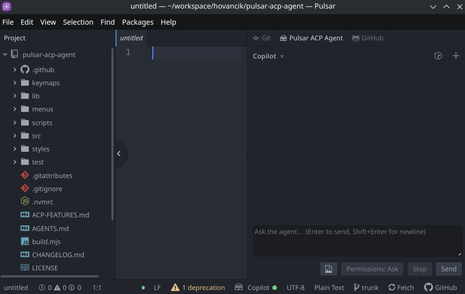
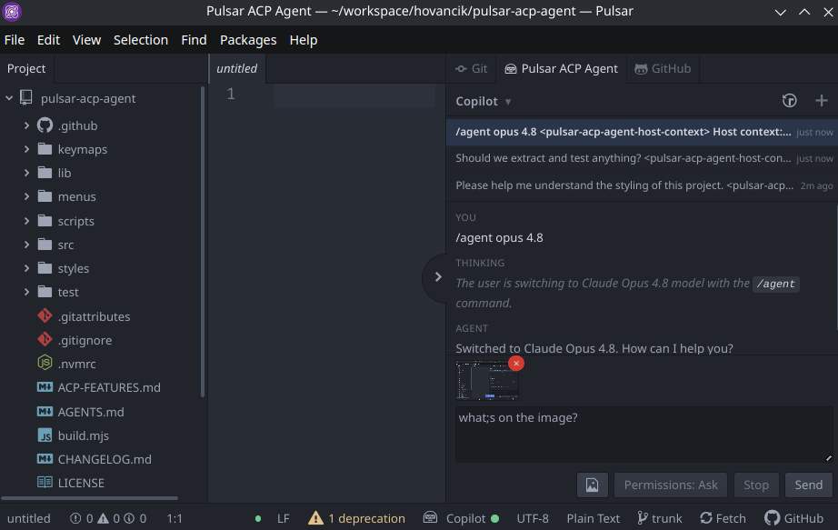
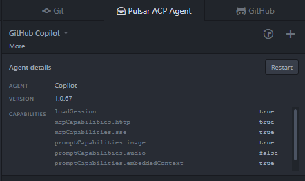
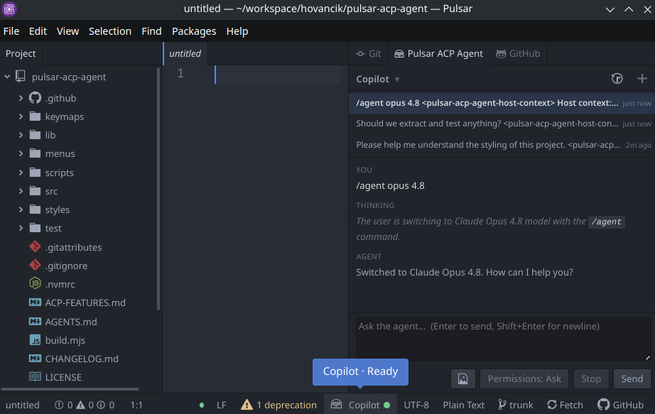
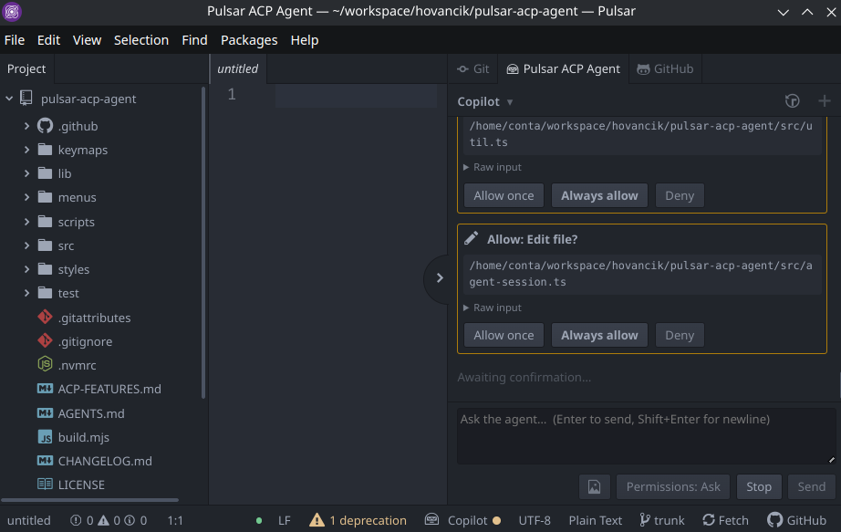
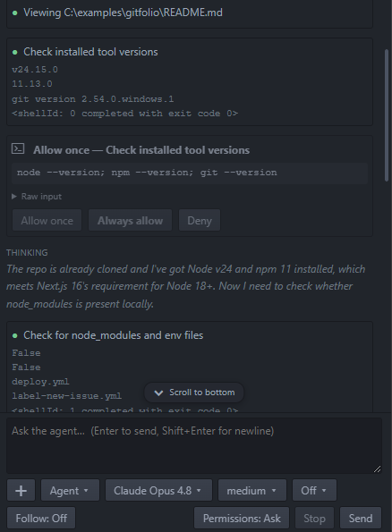
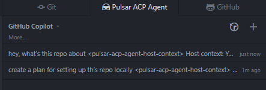

# 🤖 Pulsar ACP Agent

Pulsar package for using [Agent Client Protocol (ACP)](https://agentclientprotocol.com)-compatible coding agents inside the editor.

> This package is being written by AI coding agents, with human guidance.

Currently tested with GitHub Copilot CLI and Mistral Vibe.

## Install

In Pulsar, open **Settings → Install**, search for `pulsar-acp-agent`, and click
**Install**. Or from a terminal:

```sh
ppm install pulsar-acp-agent
```

Package page: <https://packages.pulsar-edit.dev/packages/pulsar-acp-agent>

## Example configuration with Copilot CLI

Install Copilot CLI and authenticate once:

```sh
copilot login
```

Defaults:

- command: `copilot --acp --stdio`
- send host context: enabled

If Pulsar cannot find `copilot`, set the full command line with an absolute
path (keep the arguments) in:

```text
Settings -> Packages -> pulsar-acp-agent -> Agent command
```

On Linux this may be something like:

```text
/home/you/.local/bin/copilot --acp --stdio
```

Wrap a path that contains spaces in double quotes, e.g.
`"C:\Program Files\agent\agent.exe" --acp --stdio`.

By default, Pulsar ACP Agent also sends a short host-context hint once per
session so the agent knows the conversation is happening through Pulsar, while
also making clear that the agent cannot directly control Pulsar's UI. Disable
**Send host context** in package settings if you do not want this extra context
included in prompts.

## Use

- Toggle panel: `Ctrl+Alt+A`
- Command palette: `Pulsar ACP Agent: Toggle Panel`
- Send: `Enter`
- Newline: `Shift+Enter`
- Stop: cancel current turn
- Restart: button in the agent details panel (click the agent name)



If the agent advertises image prompt support, attach PNG, JPEG, GIF, or WebP
images up to 5 MiB via the attachment button, drag-and-drop, or paste.



Once connected, the header shows the agent's name. Click the name to open the agent
details: version, advertised capabilities and metadata as key/value rows, and a
Restart button. A status row below the header shows token usage when the agent
reports it.



When the agent advertises session modes (for example GitHub Copilot's
*Agent*, *Plan*, and *Autopilot*), a mode selector appears at the left of
the footer showing the current mode. Pick another mode to switch it; the agent
may also change it mid-session, and the selector updates to match.

When Pulsar's status bar service is available, it shows a tile with the agent
name when known, otherwise `Agent`, plus a state dot: a hollow ring while
connecting, then solid for ready, working, or error, and the theme's warning
color while awaiting your confirmation of a permission request. Click the tile
to reveal the panel.



A **Permissions** pill in the footer toggles between `Ask` (default) and
`Allow all`. In `Allow all` mode, ACP permission prompts are auto-approved for
the session using `allow_once`. If no `allow_once` option is offered, the
prompt is shown normally. The toggle is session-local and resets when the view
is closed, restarted, or switched to a different session. It does not sandbox
or restrict what the agent process can do; it only skips the confirmation dialog.



Tool calls, diffs and terminal output are rendered inline in the conversation,
with long output collapsed behind a **Show more** toggle.



After connection, a **Sessions** list is accessible via the history icon in the
panel header when the agent advertises `sessionCapabilities.list`; switching is
enabled when the agent also advertises `loadSession`. If the agent advertises
`sessionCapabilities.delete`, a trashcan button appears on hover to permanently
remove a session. Use the **+** icon in the header to start a new session.



New sessions use the first open project folder as their working directory.
Multi-root workspaces are not supported yet: only the first open project folder
is sent to the agent and allowed for file access. Loaded sessions keep their
recorded working directory when it is still inside that project.

## Develop

```sh
git clone https://github.com/hovancik/pulsar-acp-agent.git
cd pulsar-acp-agent
npm install
ppm link          # symlink the checkout into Pulsar
npm run typecheck
npm run build
npm run watch
```

Pulsar loads `lib/main.js`. Rebuild after editing `src/`, then reload Pulsar.

## Architecture

- `src/main.ts` registers commands, opener, dock item, deserializer, and
  status-bar service consumer.
- `src/agent-view.ts` renders the panel UI.
- `src/agent-session.ts` manages the ACP session via `@agentclientprotocol/sdk`.
- `src/util.ts` holds pure helpers (`parseCommandLine`, `TerminalRecord`) split
  out so they can be unit-tested without loading `atom`.

The SDK is ESM-only, so esbuild bundles it and `zod` into `lib/main.js`.

## Testing

`npm test` runs Node's built-in runner over `test/*.test.mjs`. Run
`npm run build` first because tests import the built `lib/util.js`.

## Supported ACP features

| Feature | Status |
| --- | --- |
| `fs.readTextFile` / `fs.writeTextFile` | yes, restricted to the session working directory |
| `session/request_permission` | yes |
| `terminal` | yes, working directory is restricted to the project |
| `authenticate` | yes, uses the first auth method advertised by the agent |

Beyond ACP, this package also adds:

| Feature | Status |
| --- | --- |
| host context hint | yes, sent once per session by default |

## Security

The agent runs as a separate command-line process that Pulsar launches with
your user account. Pulsar does not sandbox it, so it has the same access to
your machine as any program you run yourself.

The limits below only constrain the requests an agent makes **through Pulsar**
over ACP. They do not restrict what the agent does in its own process:

- `fs/read_text_file` and `fs/write_text_file` are served only when the target
  path resolves inside the session working directory; the agent reads and writes
  there without a per-action prompt.
- Writes to open files with unsaved changes are refused.
- The ACP `terminal` capability is accepted: the agent can run commands *through*
  Pulsar, with their merged output shown in the panel. Commands default to the
  session working directory; an agent-requested absolute `cwd` is allowed only
  inside the project. Commands run as separate processes with your user account.
  There is **no per-command approval prompt** and no sandbox — a launched command
  can do anything your account can. Stop cancels the current turn; terminals
  are killed when the agent releases/kills them, when you switch or restart
  sessions, or when you close the panel.

These are guard rails for a cooperating agent, not a security boundary: a
malicious agent can read or write any file your account can, or run any command,
without going through Pulsar at all. Use Pulsar ACP Agent only with agents you
trust; for stronger isolation, run it inside a container or VM.
