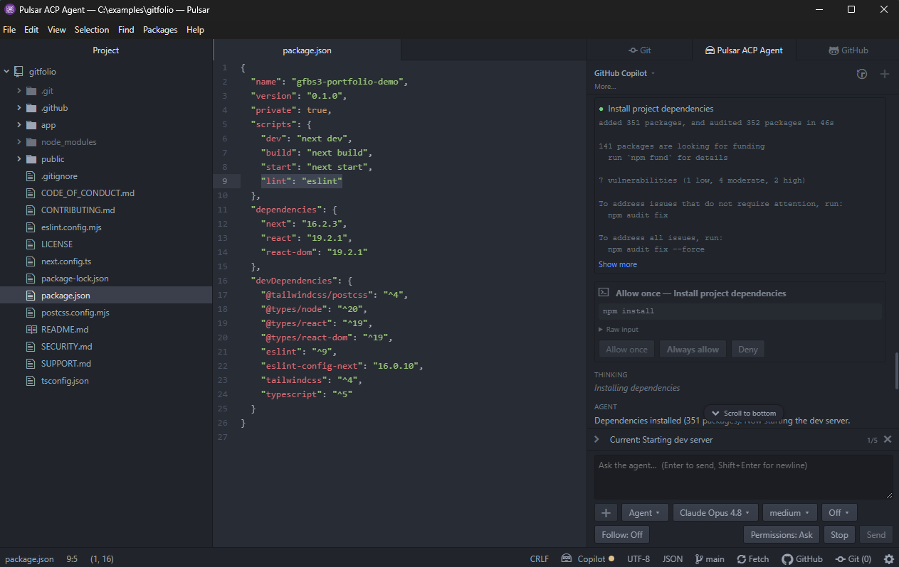
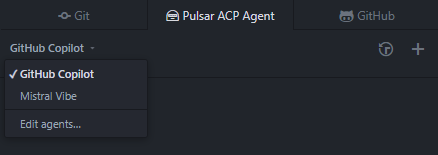
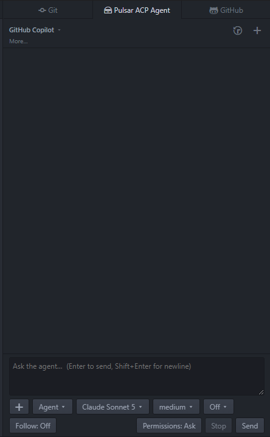
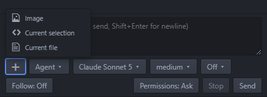
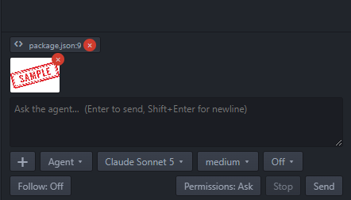
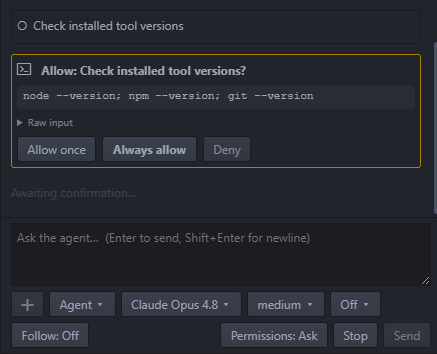
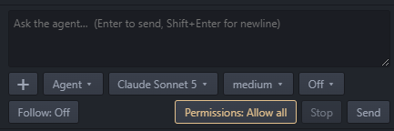
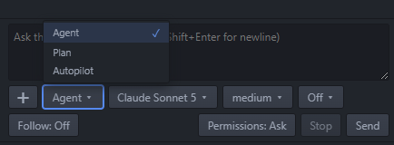
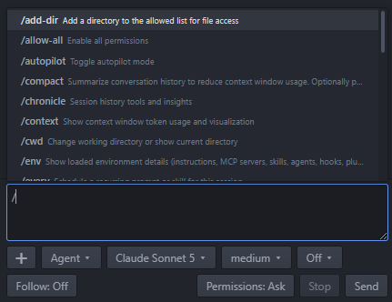
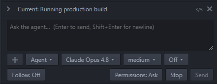

# 🤖 Pulsar ACP Agent

[](https://packages.pulsar-edit.dev/packages/pulsar-acp-agent)
[](https://packages.pulsar-edit.dev/packages/pulsar-acp-agent)
[](LICENSE)
[](https://github.com/hovancik/pulsar-acp-agent/actions/workflows/ci.yml)

Bring your own [Agent Client Protocol (ACP)](https://agentclientprotocol.com)-compatible AI coding agent into [Pulsar](https://pulsar-edit.dev).



_Pulsar ACP Agent running an ACP-compatible coding agent inside Pulsar._

Highlights:

- Run [ACP-compatible coding agents](https://agentclientprotocol.com/get-started/agents)
  such as GitHub Copilot CLI, Mistral Vibe, and Gemini CLI from a Pulsar dock panel.
- Attach files, selections, and images to prompts.
- Review permission prompts, tool output, diffs, plans, and session history inline.
- Configure and switch between multiple agents.

> This package is being written by AI coding agents, with human guidance.

Currently tested with GitHub Copilot CLI and Mistral Vibe.

## Table of contents

- [Install](#install)
- [Configure agents](#configure-agents)
  - [Example: Copilot CLI](#example-copilot-cli)
  - [Selecting agents](#selecting-agents)
- [Use](#use)
  - [The panel](#the-panel)
  - [Agent details](#agent-details)
  - [Attaching files and images](#attaching-files-and-images)
  - [Permissions](#permissions)
  - [Session configuration](#session-configuration)
  - [Slash commands](#slash-commands)
  - [Tool calls, diffs, and plans](#tool-calls-diffs-and-plans)
  - [Following the agent](#following-the-agent)
  - [Sessions](#sessions)
  - [Working directory](#working-directory)
  - [Status bar](#status-bar)
- [Develop](#develop)
- [Architecture](#architecture)
- [Testing](#testing)
- [Supported ACP features](#supported-acp-features)
- [Security](#security)

## Install

In Pulsar, open **Settings → Install**, search for `pulsar-acp-agent`, and click
**Install**. Or from a terminal:

```sh
ppm install pulsar-acp-agent
```

Package page: <https://packages.pulsar-edit.dev/packages/pulsar-acp-agent>

## Configure agents

### Example: Copilot CLI

Install Copilot CLI and authenticate once:

```sh
copilot login
```

Defaults:

- A **GitHub Copilot** agent (`copilot --acp --stdio`) is seeded the first time the
  package activates.
- send host context: enabled

### Selecting agents

The agent picker in the header (top-left) shows the active agent and lets you
switch between configured agents or open **Edit agents…**. Switching stops the
current agent and clears the conversation. See [Agent details](#agent-details)
for the connected agent's live runtime info.



Agents are stored in your Pulsar config file (`config.cson`) under the
`pulsar-acp-agent` namespace and are managed from the picker or by editing the
file directly:

```cson
"pulsar-acp-agent":
  activeAgentId: "copilot"
  agents:
    copilot:
      name: "GitHub Copilot"
      command: "copilot --acp --stdio"
    gemini:
      name: "Gemini CLI"
      command: "gemini --experimental-acp"
  version: 1
```

- `agents` maps a stable id to an agent `{ name, command }`.
- `activeAgentId` selects which agent launches; it persists across reloads.
- `command` is a full command line for an executable that speaks ACP over stdio.
  It can also launch the agent without a global install, e.g.
  `npx @google/gemini-cli --experimental-acp`.

Run **Pulsar ACP Agent: Edit Agents** (also in the picker and the Packages menu)
to open the config file. Changes apply on the next Restart or Switch.

If Pulsar cannot find the executable, set its full absolute path in `command`.
On Linux this may be something like:

```text
/home/you/.local/bin/copilot --acp --stdio
```

Wrap a path that contains spaces in double quotes, e.g.
`"C:\Program Files\agent\agent.exe" --acp --stdio`.

By default, Pulsar ACP Agent also sends a short host-context hint once per
session so the agent knows the conversation is happening through Pulsar, while
also making clear that the agent cannot directly control Pulsar's UI. Disable
**Send host context** in package settings if you do not want this extra context
included in prompts.

## Use

### The panel

Open the panel with `Ctrl+Alt+A` or from the command palette
(**Pulsar ACP Agent: Toggle Panel**). **Pulsar ACP Agent: Focus Panel** opens
and focuses the panel without toggling it closed. Type your prompt in the
composer and press `Enter` to send or `Shift+Enter` for a newline; **Stop**
cancels the current turn.



### Agent details

Once connected, click **More...** in the header to show or hide the agent's
self-reported name, version, advertised capabilities, and metadata as key/value
rows, plus agent actions such as Restart. The same live row shows context-token
usage when the agent reports it.


### Attaching files and images

Attach prompt content from the composer's **Attach to prompt** button. Its menu
offers:

- **Image** — pick a PNG, JPEG, GIF, or WebP image up to 5 MiB (you can also
  drag-and-drop or paste images straight into the input); shown when the agent
  advertises image prompt support.
- **Current selection** — attach the current editor selection.
- **Current file** — attach the active editor file.



Selection and File are shown when the agent advertises embedded-context support,
and are also available from the editor right-click menu and the commands
`Pulsar ACP Agent: Add Active File to Prompt` and
`Pulsar ACP Agent: Add Selection to Prompt`. Attachments appear as removable
chips above the input and are sent inline as ACP `resource` blocks (the active
file is re-read when you send, so unsaved edits are included). The file must be
inside the open project.



### Permissions

A **Permissions** pill in the footer toggles between `Ask` (default) and
`Allow all`. In `Ask` mode, the agent's permission requests are shown inline so
you can approve or deny each one.



In `Allow all` mode, ACP permission prompts are auto-approved for the session
using `allow_once`. If no `allow_once` option is offered, the prompt is shown
normally. The toggle is session-local and resets when the view is closed,
restarted, or switched to a different session. It does not sandbox or restrict
what the agent process can do; it only skips the confirmation dialog.



### Session configuration

When the agent exposes session configuration options (such as model, custom
agent, or reasoning effort), the footer shows a dropdown for each. Selecting a
value applies it to the active session; the agent stays authoritative, so the
dropdowns reflect whatever it reports back. Options are per-session.



### Slash commands

When the agent advertises slash commands, typing `/` at the start of the
composer opens a completion popup of its commands, each with a description.
Filter by typing, navigate with the arrow keys, and select with Enter, Tab, or
a click. Commands that take no argument are sent immediately; commands that take
an argument insert `/name ` and show the agent's hint so you can finish the line
and press Enter. Commands are per-session and update live as the agent reports
them.



### Tool calls, diffs, and plans

Tool calls, diffs and terminal output are rendered inline in the conversation,
with long output collapsed behind a **Show more** toggle.


When the agent reports an execution plan, a collapsible **Plan** bar appears
above the input showing progress and the current step. It stays pinned while the
conversation scrolls and can be dismissed; completed plans are snapshotted into
the conversation.



### Following the agent

Toggle the **Follow** button in the footer to have Pulsar open and scroll to each
file the agent works on, keeping the editor in step with its progress without
stealing focus from the panel. Following is off by default and turns off again as
soon as you navigate to a different file yourself.

### Sessions

After connection, a **Sessions** list is accessible via the history icon in the
panel header when the agent advertises `sessionCapabilities.list`; switching is
enabled when the agent also advertises `loadSession`. If the agent advertises
`sessionCapabilities.delete`, a trashcan button appears on hover to permanently
remove a session. Use the **+** icon in the header to start a new session.


### Working directory

New sessions use the first open project folder as their working directory.
Multi-root workspaces are not supported yet: only the first open project folder
is sent to the agent and allowed for file access. Loaded sessions keep their
recorded working directory when it is still inside that project.

### Status bar

When Pulsar's status bar service is available, it shows a tile with the agent
name when known, otherwise `Agent`, plus a state dot: a hollow ring while
connecting, then solid for ready, working, or error, and the theme's warning
color while awaiting your confirmation of a permission request. Click the tile
to reveal the panel.


## Develop

```sh
git clone https://github.com/hovancik/pulsar-acp-agent.git
cd pulsar-acp-agent
npm install
ppm link          # symlink the checkout into Pulsar
npm run typecheck
npm run build
npm run watch
```

Pulsar loads `lib/main.js`. Rebuild after editing `src/`, then reload Pulsar.

## Architecture

- `src/main.ts` registers commands, opener, dock item, deserializer, and
  status-bar service consumer.
- `src/agent-view.ts` renders the panel UI.
- `src/agent-session.ts` manages the ACP session via `@agentclientprotocol/sdk`.
- `src/agent-config.ts` holds the pure agent-registry logic (normalize, migrate,
  resolve) split out so it can be unit-tested without loading `atom`.
- `src/util.ts` holds pure helpers (`parseCommandLine`, `flattenInfoRows`,
  `TerminalRecord`) split out so they can be unit-tested without loading `atom`.

The SDK is ESM-only, so esbuild bundles it and `zod` into `lib/main.js`.

## Testing

`npm test` runs Node's built-in runner over `test/*.test.mjs`. Run
`npm run build` first because tests import the built bundles (`lib/util.js`,
`lib/agent-config.js`), not `src/`.

## Supported ACP features

| Feature | Status |
| --- | --- |
| `fs/read_text_file` / `fs/write_text_file` | yes, restricted to the session working directory |
| `session/request_permission` | yes |
| `terminal` | yes, working directory is restricted to the project |
| `authenticate` | yes, on demand when the agent reports it's required; prompts to choose when the agent offers multiple sign-in methods |

Beyond ACP, this package also adds:

| Feature | Status |
| --- | --- |
| host context hint | yes, sent once per session by default |

## Security

The agent runs as a separate command-line process that Pulsar launches with
your user account. Pulsar does not sandbox it, so it has the same access to
your machine as any program you run yourself.

The limits below only constrain the requests an agent makes **through Pulsar**
over ACP. They do not restrict what the agent does in its own process:

- `fs/read_text_file` and `fs/write_text_file` are served only when the target
  path resolves inside the session working directory; the agent reads and writes
  there without a per-action prompt.
- Writes to open files with unsaved changes are refused.
- The ACP `terminal` capability is accepted: the agent can run commands *through*
  Pulsar, with their merged output shown in the panel. Commands default to the
  session working directory; an agent-requested absolute `cwd` is allowed only
  inside the project. Commands run as separate processes with your user account.
  There is **no per-command approval prompt** and no sandbox — a launched command
  can do anything your account can. Stop cancels the current turn; terminals
  are killed when the agent releases/kills them, when you switch or restart
  sessions, or when you close the panel.

These are guard rails for a cooperating agent, not a security boundary: a
malicious agent can read or write any file your account can, or run any command,
without going through Pulsar at all. Use Pulsar ACP Agent only with agents you
trust; for stronger isolation, run it inside a container or VM.
